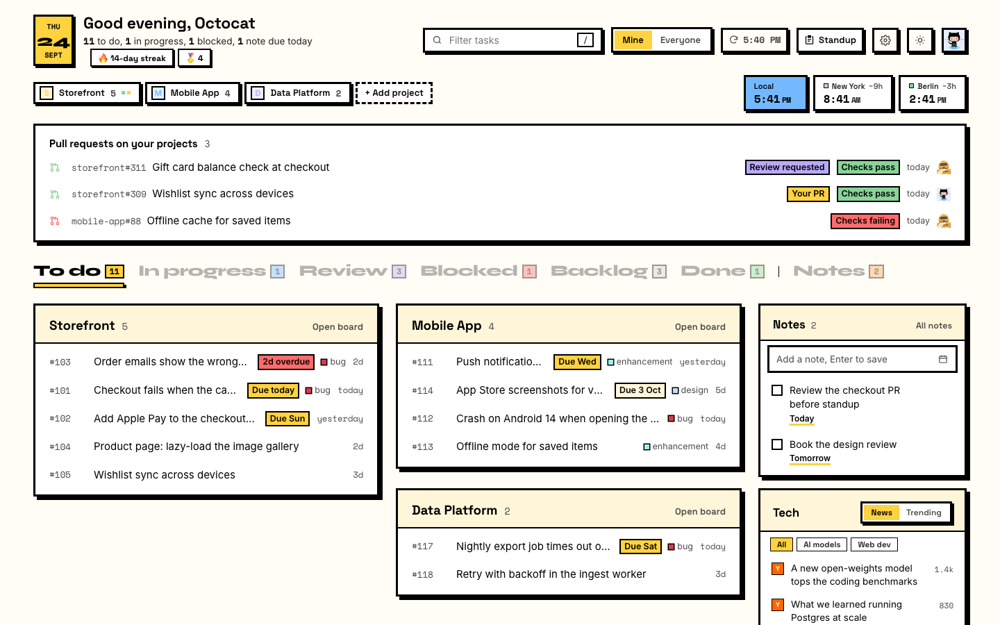
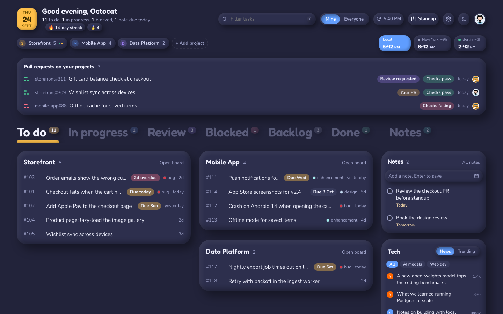
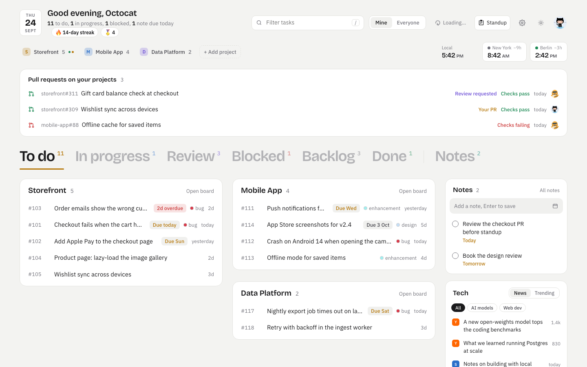

# Tabboard

Your GitHub Projects tasks, pull requests, notes and tech news on every new Chrome tab.

It opens instantly from what it loaded last time, then refreshes from GitHub in the background: your boards first, everything else right after.

## Features

- **Tasks by status** (To do, In progress, Review, Blocked, Backlog, Done), grouped by board. Hover a task for details.
- **Several orgs at once**, plus your own projects. Picked in Settings.
- **Repos without a board.** Issues assigned to you that aren't on a board get their own card. Add a repo to see all its issues.
- **Pull requests** that need you (review requests, mentions, your PRs) with check status.
- **Standup** for any date range, copied with formatting for Teams, Slack or email.
- **Notes**: private to-dos with due dates.
- **Project links**: production, staging and other links per project.
- **World clocks** for your teammates' timezones. Search by city, `PKT`, `EST` or `UTC+5`.
- **Tech news and trending** from Hacker News, Simon Willison's blog, GitHub and Hugging Face, filtered by your topics.
- **Fun extras**: a contribution streak, achievements, a weekly "week in code" card and a few easter eggs. One switch turns them off.
- **Three looks**: Brutal (default), Clay and Soft, each in light and dark.

| Clay, dark | Soft, light |
|:---:|:---:|
|  |  |

## Install

Not on the Chrome Web Store yet. From source:

1. Clone this repo, or download the ZIP and unzip it.
2. Open `chrome://extensions` and turn on **Developer mode**.
3. Click **Load unpacked** and pick the repo folder.
4. Open a new tab and click **Sign in with GitHub**.

To update: `git pull`, then click ↻ on Tabboard in `chrome://extensions`.

## Signing in

**Sign in with GitHub** uses GitHub's device flow: you get a short code, enter it on github.com and approve. There's no server; the token goes straight from GitHub to your browser.

Prefer a token? Choose **Use a token instead** and paste a classic token with `repo`, `read:project` and `read:org`. You can connect several accounts and switch from the avatar menu.

If your org restricts third-party apps, an org owner approves Tabboard once in the org's **Third-party access** settings.

## Using it

**Keyboard shortcuts**

| Key | Action |
|:---|:---|
| `/` | Filter tasks |
| `1`–`7` | Switch status tab (7 is Notes) |
| `M` | Mine / Everyone |
| `N` | New note |
| `S` | Standup |
| `C` / `O` | Copy / open the hovered task |
| `W` | Your week in code |
| `Alt+Shift+T` | Switch new tabs between Tabboard and Chrome's own page |

**Chrome's normal new tab.** Click **Chrome** in the "New tab page" switch at the top. New tabs open Chrome's page until you click Tabboard's toolbar icon or press `Alt+Shift+T`.

**Offline.** You keep seeing your last data, with an "Offline" badge showing its time. Tabboard refreshes by itself when you're back.

**Board fields.** Tabboard reads a board's **Status** field for columns and **Target date** for due dates. Different names? Change them in Settings → Boards.

## Permissions and privacy

| Permission | Why |
|:---|:---|
| `api.github.com` | Load your boards, issues, pull requests and contributions |
| `github.com/login` | Sign in with GitHub (device flow) |
| `storage` | Remember whether new tabs open Tabboard or Chrome's page |
| `activeTab` | Let the toolbar icon switch the tab you're on |

News comes from `hn.algolia.com`, `simonwillison.net` and `huggingface.co`, only for the sources you enable.

Your token, notes, settings and cached data stay in the extension's storage in your browser. They aren't encrypted and aren't sent anywhere else. To remove access completely, sign out and revoke Tabboard in GitHub → Settings → Applications.

## Contributing

Bug reports, ideas and pull requests are welcome. See [CONTRIBUTING.md](CONTRIBUTING.md). Security issues: see [SECURITY.md](SECURITY.md).

## License

[MIT](LICENSE)
